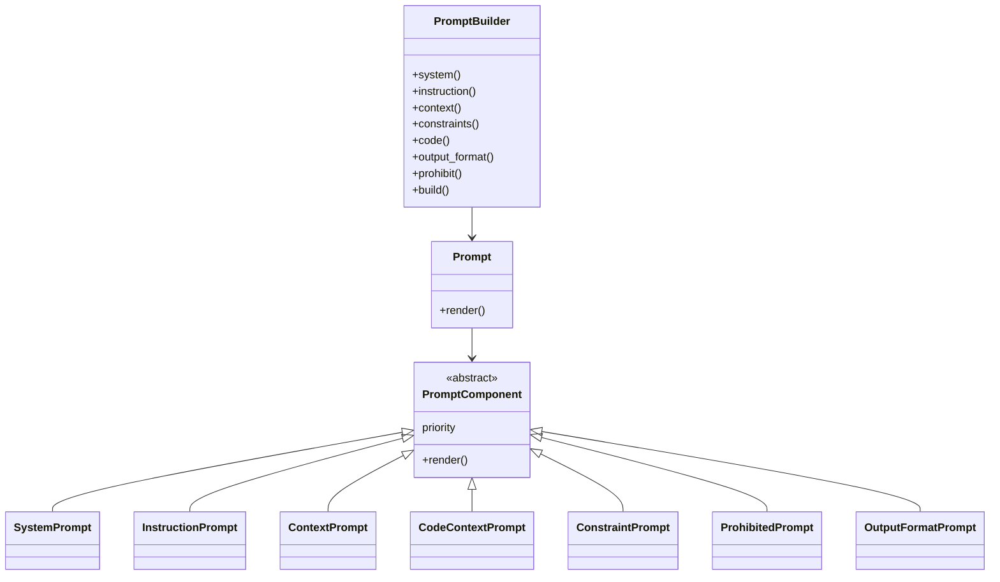

# Prompt Builder

Claude Code などの **コーディングエージェント向けプロンプトを構造的・安全に組み立てるための Python ライブラリ** です。

自然言語プロンプトを「文章の塊」として扱うのではなく、
**意味を持った構成要素（System / Instruction / Context / Constraint / Code …）に分解し、
priority に基づいて再構成する** ことを目的としています。

---

## 特徴

* 🧱 **プロンプトの構造化**
  プロンプトを意味単位（PromptComponent）で表現

* 🔢 **priority による自動整列**
  記述順に依存せず、意味的に正しい順序でレンダリング

* 🛡 **安全装置としてのバリデーション**
  必須コンポーネント未定義をクラスレベルで検出

* 🔌 **拡張容易**
  新しい PromptComponent を追加するだけで機能拡張可能

---

## 想定ユースケース

* Claude Code / ChatGPT / Gemini などへの

  * コードレビュー依頼
  * リファクタリング指示
  * 設計レビュー
  * 仕様説明 + コード文脈提示

* プロンプトの

  * 再利用
  * テンプレート化
  * 品質担保

---

## 全体構成

```text
src/
└─ prompt/
   ├─ component/        # プロンプト構成要素
   ├─ prompt.py         # 最終プロンプト表現
   ├─ prompt_builder.py # ビルダー
   └─ prompt_priority.py# 表示優先度定義
```

---

## アーキテクチャ概要



---

## PromptComponent 設計方針

### 共通ルール

* すべての PromptComponent は以下を満たす必要があります

```python
class PromptComponent(ABC):
    priority: PromptPriority
    def render(self) -> str: ...
```

* `priority` は **必須**
* 未定義の場合はクラス定義時に例外を送出

```python
class PromptComponent(ABC):
    priority: PromptPriority | None = None

    def __init_subclass__(cls):
        if cls.priority is None:
            raise TypeError(...)
```

👉 実行前に設計ミスを検出するための安全装置

---

## PromptPriority（表示順序）

```python
SYSTEM        = 100
INSTRUCTION   = 200
CONTEXT       = 300
CODE_CONTEXT  = 400
CONSTRAINT    = 500
PROHIBITED    = 600
OUTPUT_FORMAT = 700
```

* 数値が小さいほど先に表示
* 「実装都合」ではなく **意味的な構造** を表す

---

## PromptBuilder の使い方

```python
from prompt.prompt_builder import PromptBuilder

prompt = (
    PromptBuilder()
    .system("熟練したJavaアーキテクト")
    .context("既存のSpring Batchシステムをモダナイズしたい")
    .instruction("設計上の改善点を洗い出してください")
    .constraints([
        "Java 8以上を前提とする",
        "実務レベルの具体性を持たせる",
    ])
    .build()
)

print(prompt.render())
```

### 出力例

```text
あなたは熟練したJavaアーキテクトです。

設計上の改善点を洗い出してください

## 前提情報
既存のSpring Batchシステムをモダナイズしたい

## 制約
- Java 8以上を前提とする
- 実務レベルの具体性を持たせる
```

---

## CodeContextPrompt（コード文脈の注入）

```python
.builder.code(
    "src/service/user_service.py",
    user_service_code
)
```

```text
## ファイル: src/service/user_service.py
```

```python
class UserService:
    ...
```

👉 Claude Code に「このコードを見て考えろ」と明示できる

---

## 設計上のポイント

### なぜ priority をクラスに持たせるのか？

* 呼び出し順序に依存しない
* 人間が書きやすい順序 ≠ AI が理解しやすい順序
* プロンプトの **意味構造をコードで保証** できる

---

### なぜ Builder + Prompt を分離しているのか？

| クラス           | 責務         |
| ------------- | ---------- |
| PromptBuilder | 組み立て方（HOW） |
| Prompt        | 表現（WHAT）   |

👉 単一責任・拡張容易性

---

## まとめ

このライブラリは

> **プロンプトを「文章」ではなく「設計物」として扱う**

ための基盤です。

Claude Code のような強力なコーディングエージェントほど、
**入力の構造化が出力品質を決定づけます。**
